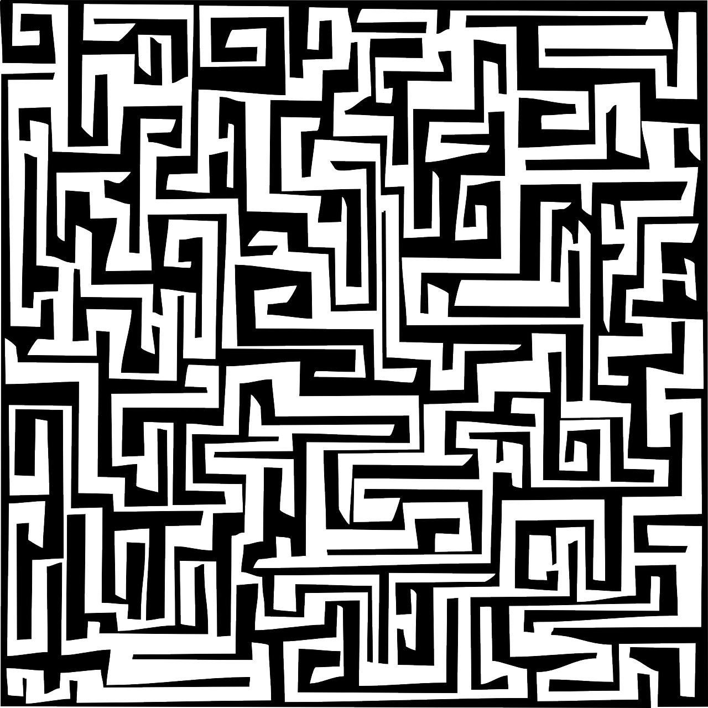

# Labyrinth



What is the Labyrinth?
---
Labyrinth is the matching Paper Plugin written in Java for the Labyrinth Community Project on our Survival Server.
Its whole purpose at the moment is to create a zone where mobs can't spawn so that players don't need to light up the whole labyrinth

### About Mobspawning
On our server there is no lighting below / above, and we don't want mobs to spawn there, also Bats are friendly but
Only spawn in caves or when Minecraft thinks we are in a cave, so we don't want to let them spawn too.
---
### Permissions

```labyrinth.setup.center```
- This permission is needed to create the center of the zone.
---
```labyrinth.setup.setradius```
- This permission is needed to set the radius of the zone.
---
```labyrinth.toggle.mobspawn```
- This permission is needed to toggle mobspawning for the zone.
---
```labyrinth.setup.createzone``` 
- This permission is needed to create a new zone entry.
---
### Features (zone needs to be created in this order)
- Create a zone
```/labyrinth create <zone>```
---
- Set Center of a zone
```/labyrinth center <zone>```
---
- Set Radius of a zone
```/labyrinth setradius <zone>```
---
- Toggle mobspawning of a zone
```/labyrinth toggle <zone>```


